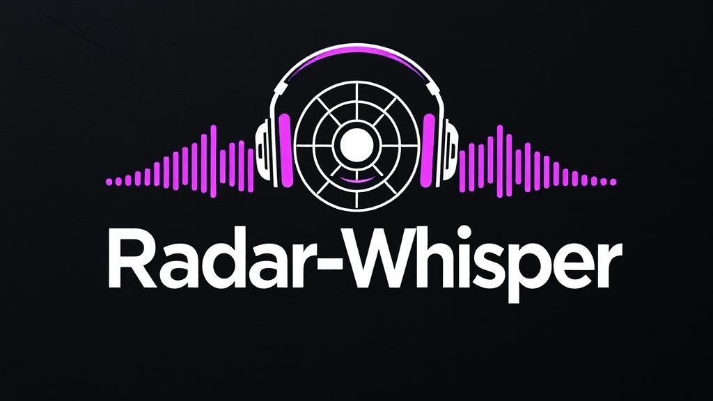
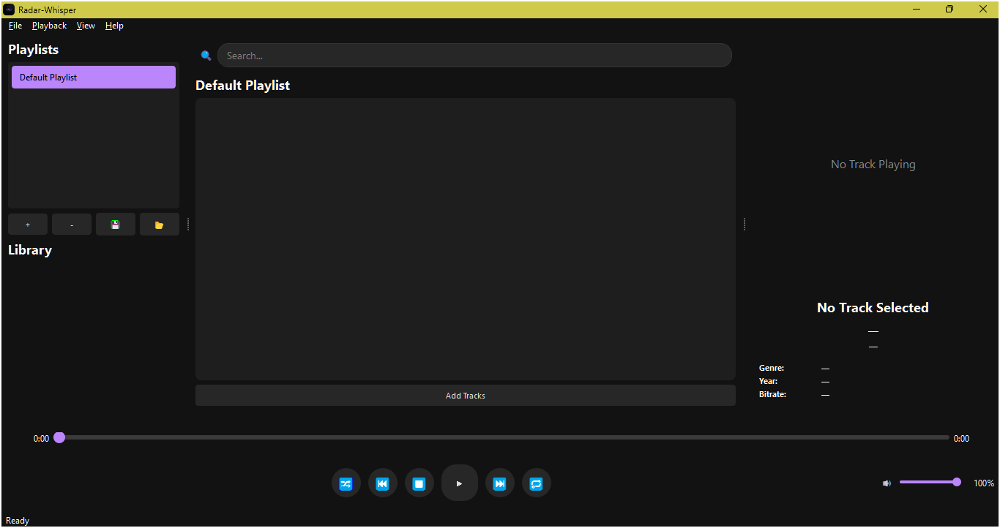
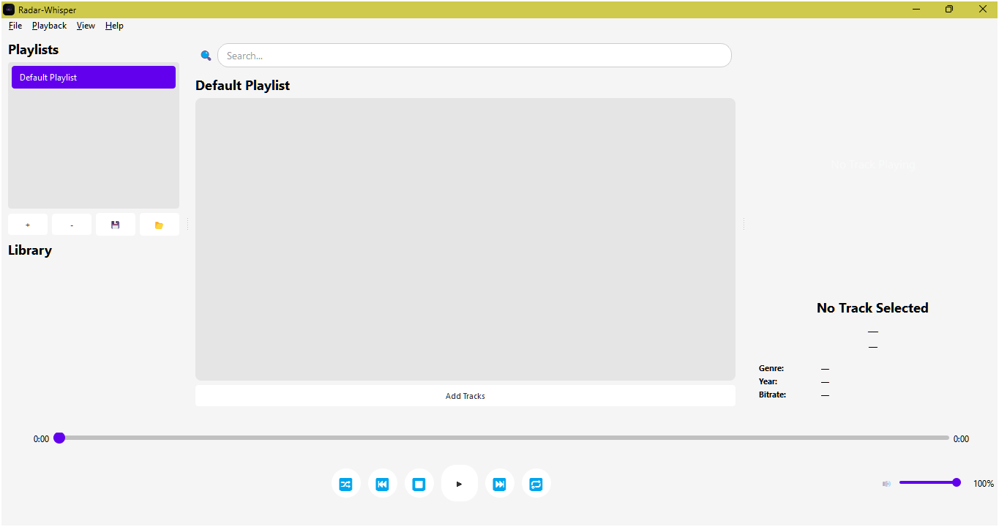

# 🎧 Radar-Whisper - Version 0.9.0 (INCOMPLETE BETA)

**Radar Whisper** is a modern and intuitive music player application, designed with a clean, stylized aesthetic and a smooth experience powered by **PyQt5**. Although it already has a functional foundation, this **0.9.0** version is still in development and includes **incomplete features**, as well as **bugs** and runtime errors. Therefore, it is recommended for **evaluation and testing purposes only**.

> ⚠️ **IMPORTANT:** Radar Whisper is not ready for general use. This version is a **BETA**.

---

🇪🇸 [README en Español](README_ES.md)

> Este proyecto incluye documentación en **Español** para facilitar su comprensión y uso por parte de una comunidad más amplia de usuarios y desarrolladores.
> This project includes documentation in **Spanish** to facilitate understanding and use by a broader community of users and developers.

---

## ✨ Current Features

- 🎨 **Customizable themes:** Supports light and dark modes.
- 🎵 **Music playback:** Audio file support.
- ⏱️ **Interactive progress bar:** Scrollable for track time seeking.
- 🔊 **Volume control:** Slider with mute function.
- ⏯️ **Standard playback controls:** Play, pause, stop, next, previous, shuffle, and repeat (implemented but not functional).
- 📃 **Drag-and-drop playlist:** Dynamically loads tracks, allows manual sorting.
- 🖼️ **Track info panel:** Title, artist, duration, cover art (still being refined), and bitrate (also still being refined).
- 🔍 **Integrated search:** Dynamic track filtering.

---

## 📂 Project Structure

```plaintext
Radar-Whisper/
│
├── main.py                 # Main entry point of the application.
├── main_window.py          # Main window setup and display logic.
├── ui_components.py        # Definition of custom widgets and visual elements.
├── playlist_manager.py     # Logic for playlist management.
├── metadata_handler.py     # Reads, processes, and formats track metadata.
├── audio_player.py         # Core audio playback controller.
│
├── icon.ico                # App icon.
├── icon.png                # App icon.
├── Banner.png              # Graphic banner
├── Capture.png             # Screenshot (dark theme).
├── Capture2.png            # Screenshot (light theme).
└── radar_animation.gif     # Decorative animation.
│
└── README.md               # This document.
```

## 🔧 Development Status (Version 0.9.0)

| Component         | Status        | Notes                                                    |
| ----------------- | ------------- | -------------------------------------------------------- |
| Audio playback    | 🟢 Functional | Limited to some formats.                                 |
| Playlists         | 🟡 Partial    | Persistence between sessions is missing.                 |
| GUI               | 🟢 Functional | Basic aesthetics implemented, advanced settings pending. |
| Volume control    | 🟢 Functional | No keyboard shortcuts yet.                               |
| Info panel        | 🔴 Incomplete | Displays limited metadata. Full integration pending.     |
| Dark/Light mode   | 🟡 Partial    | Requires manual restart.                                 |
| General stability | 🟠 Unstable   | May crash with corrupted files.                          |

---

## 💻 System Requirements

- Python 3.8+
- PyQt5
- Mutagen (for audio metadata handling)
- OS: Windows, Linux (partial), macOS (untested)

---

## 🚀 Installation and Running

### 1. Clone the repository

```bash
git clone https://github.com/Ivan-Ayub97/Radar-Whisper.git
cd radar-whisper
```

### 2. Create virtual environment (optional but recommended)

```bash
python -m venv venv
source venv/bin/activate    # Linux/macOS
venv\Scripts\activate.bat   # Windows
```

### 4. Run the application

```bash
python main.py
```

---

## 📸 Screenshots

### Dark Theme



### Light Theme



---

## 🧩 Roadmap (Upcoming Versions)

- [ ] Error-free track repeat
- [ ] Full metadata integration (artist, album, genre, year)
- [ ] Support for multiple audio formats (OGG, M4A, etc.)
- [ ] Playlist persistence in local files
- [ ] Mini-player mode
- [ ] Floating player
- [ ] Full Linux support

---

## 🤝 Open Source Community Invitation

> This project is open to the community. Whether you're a developer, designer, tester, or simply curious to contribute—you're welcome!

### Ways to contribute

- Report bugs by opening an [Issue](https://github.com/your-username/radar-whisper/issues)
- Improve incomplete features
- Refactor code
- Translate the interface
- Suggest UI improvements
- Share ideas in discussions

#### Recommendations

- Fork the repository
- Create a new branch with your feature
- Make a well-documented Pull Request

You don’t need to be an expert to contribute—every improvement counts.

---

## ⚠️ Known Issues / Limitations

- Track repeat shows a metadata handling error.
- Playing a new track requires stopping the previous one.
- The program may crash with unsupported audio files.
- Icons may not render correctly on Linux.
- No error handling for corrupted tracks.
- Playlists are not saved between sessions.
- Some UI features are not optimized for low resolutions.

---

## 📜 License

This project is licensed under the **[MIT License](LICENSE)**. Feel free to use, modify, and distribute it.

---

## 👤 Author

- **Lead Developer**: [Ivan E. C. Ayub](https://github.com/Ivan-Ayub97)
- **Contact**: <negroayub97@gmail.com> (optional)
- **Technologies used**: Python 3, PyQt5, Mutagen

---

## 🌟 Acknowledgments

Thanks to the entire developer community that supports Open Source projects. Feel free to collaborate, share, fork, and improve this music player step by step.

---

## 🎯 Why Radar Whisper?

Because we believe music deserves an elegant, free, and adaptable environment. Radar Whisper was born as a stylized alternative focused on user experience and open to collaborative evolution.


