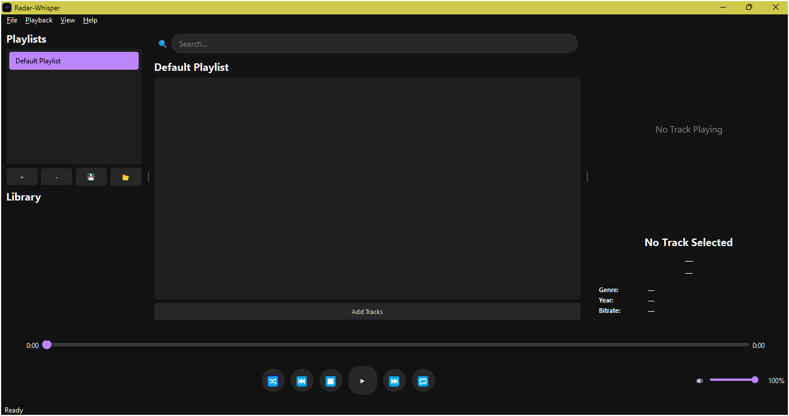
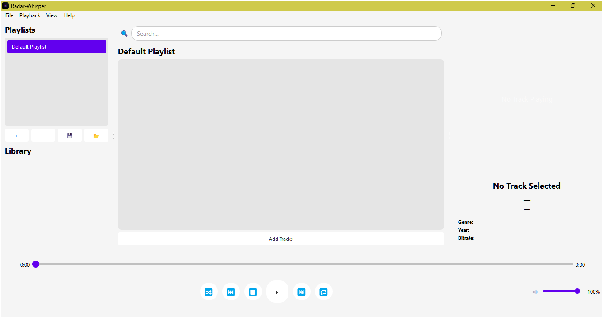

# 🎧 Radar-Whisper - Versión 0.9.0 (BETA Incompleta)

**Radar Whisper** es una aplicación moderna e intuitiva para la reproducción de música, diseñada con una estética limpia, estilizada y una experiencia fluida basada en **PyQt5**. Aunque ya cuenta con una base funcional, esta versión **0.9.0** aún está en desarrollo y contiene **funciones incompletas**, así como **bugs** y errores de ejecución. Por ello, se recomienda su uso solo con fines de evaluación y pruebas para mejorarlo.

> ⚠️ **IMPORTANTE:** Radar Whisper aún no está listo para uso general. Esta versión es una **BETA**.

---

## ✨ Características actuales

- 🎨 **Temas personalizables:** Compatibilidad con temas claros y oscuros.
- 🎵 **Reproducción de música:** Soporte para archivos de audio.
- ⏱️ **Barra de progreso interactiva:** Con desplazamiento para búsqueda de tiempo dentro de la pista.
- 🔊 **Control de volumen:** Deslizante con función de silenciar.
- ⏯️ **Controles de reproducción estándar:** Reproducir, pausar, detener, siguiente, anterior, reproduccion al azar y repetir pista (implementado pero sin ser funcional).
- 📃 **Lista de reproducción con drag-and-drop:** Carga dinámica de pistas, ordenamiento manual.
- 🖼️ **Panel de información de pista:** Título, artista, duración, carátula (Aun por refinar) y Bitrate (Aun por refinar).
- 🔍 **Buscador integrado:** Filtro dinámico de pistas.

---

## 📂 Estructura del Proyecto

```plaintext
Radar-Whisper/
│
├── main.py                 # Punto de entrada principal de la aplicación.
├── main_window.py          # Configuración de la ventana principal y lógica de visualización.
├── ui_components.py        # Definición de widgets y elementos visuales personalizados.
├── playlist_manager.py     # Lógica para gestionar listas de reproducción.
├── metadata_handler.py     # Lectura, procesamiento y formateo de metadatos de pistas.
├── audio_player.py         # Controlador principal de reproducción de audio.
├
├── icon.ico                # Icono de la aplicación.
├── icon.png               # Icono de la aplicación.
├── Banner.png              # Banner gráfico (tema claro).
├── Capture.png             # Captura de pantalla (tema oscuro).
└── radar_animation.gif     # Animación decorativa.
│
└── README.md               # Este documento.
```

## 🔧 Estado del desarrollo (Versión 0.9.0)

| Componente             | Estado        | Observaciones                                                  |
| ---------------------- | ------------- | -------------------------------------------------------------- |
| Reproducción de audio  | 🟢 Funcional  | Se limita a algunos formatos.                                  |
| Listas de reproducción | 🟡 Parcial    | Faltan funciones de persistencia entre sesiones.               |
| Interfaz gráfica (UI)  | 🟢 Funcional  | Estética base implementada, falta configuración avanzada.      |
| Control de volumen     | 🟢 Funcional  | Sin atajos de teclado todavía.                                 |
| Panel de información   | 🔴 Incompleto | Solo muestra algunos metadatos. Falta integración completa.    |
| Modo oscuro/claro      | 🟡 Parcial    | Requiere reinicio manual.                                      |
| Estabilidad general    | 🟠 Inestable  | Puede cerrarse inesperadamente con ciertos archivos corruptos. |

---

## 💻 Requisitos del sistema

- Python 3.8+
- PyQt5
- Mutagen (para manejo de metadatos de audio)
- OS: Windows, Linux (parcial), macOS (no probado)

---

## 🚀 Instalación y ejecución

### 1. Clonar el repositorio

```bash
git clone https://github.com/tu-usuario/radar-whisper.git
cd radar-whisper
```

### 2. Crear entorno virtual (opcional pero recomendado)

```bash
python -m venv venv
source venv/bin/activate    # Linux/macOS
venv\Scripts\activate.bat   # Windows
```

### 4. Ejecutar la aplicación

```bash
python main.py
```

---

## 📸 Capturas de pantalla

### Tema Oscuro



### Tema Claro



---

## 🧩 Roadmap (próximas versiones)
- [ ] Repeticion de pista sin errores
- [ ] Integración completa de metadatos (artista, álbum, género, año)
- [ ] Soporte para múltiples formatos de audio (OGG, M4A, etc.)
- [ ] Persistencia de listas de reproducción en archivos locales
- [ ] Modo mini reproductor
- [ ] Reproductor flotante
- [ ] Soporte completo en Linux

---

## 🤝 Invitación a la comunidad Open Source

> Este proyecto está abierto a la comunidad. Si eres desarrollador/a, diseñador/a, tester, o simplemente te interesa contribuir, ¡te damos la bienvenida!

### Formas de contribuir

- Reporta errores abriendo un [Issue](https://github.com/tu-usuario/radar-whisper/issues)
- Mejora funciones incompletas
- Refactoriza código
- Traduce la interfaz
- Propón mejoras en la UI
- Comparte ideas en las discusiones

#### Recomendaciones

- Crea un fork del repositorio
- Crea una nueva rama con tu funcionalidad
- Haz un Pull Request bien documentado

¡No necesitas ser experto para contribuir! Cada mejora cuenta.

---

## ⚠️ Conocidos problemas / Limitaciones
- La repeticion de pistas muestra un error relacionado con el manejo datos
- La reproduccion de una pista especifica requiere que la pista anterior sea detenida
- El programa puede cerrarse si se carga un archivo de audio no compatible.
- En Linux, la interfaz puede no mostrar correctamente los íconos.
- No hay comprobación de errores ante pistas corruptas.
- Las listas de reproducción no se guardan entre sesiones.
- Algunas funciones visuales no están optimizadas para resoluciones bajas.

---

## 📜 Licencia

Este proyecto está licenciado bajo los términos de la **[Licencia MIT](LICENSE)**. Puedes usarlo, modificarlo y distribuirlo libremente.

---

## 👤 Autor

- **Desarrollador principal**: [Ivan E. C. Ayub](https://github.com/Ivan-Ayub97)
- **Contacto**: <negroayub97@email.com> (opcional)
- **Tecnologías usadas**: Python 3, PyQt5, Mutagen

---

## 🌟 Agradecimientos

Agradecemos a toda la comunidad de desarrolladores que apoya proyectos Open Source. Siéntete libre de colaborar, compartir, forkar y mejorar este reproductor paso a paso.

---

## 🎯 ¿Por qué Radar Whisper?

Porque creemos que la música también merece un entorno elegante, libre y adaptable. Radar Whisper nace como una alternativa estilizada, enfocada en la experiencia del usuario y abierta a la evolución colaborativa.


---
